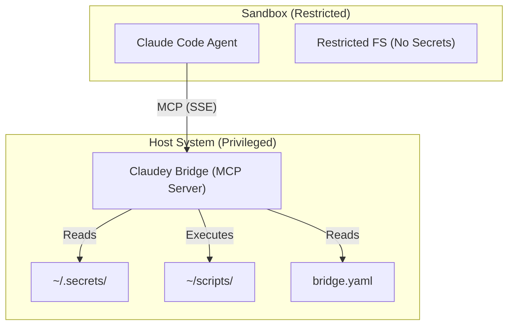

# Agent Isolation via Privileged MCP Bridge

## 1. The Problem
You want to give an autonomous agent (like Claude Code) the ability to perform useful tasks (deploying code, restarting databases, managing infrastructure) without giving it unrestricted access to your system's credentials (SSH keys, API tokens, passwords).

**The Risks:**
1.  **Prompt Injection:** A malicious user could trick the agent into reading `~/.aws/credentials` or `~/.ssh/id_rsa`.
2.  **Accidental Damage:** An agent might hallucinate a command like `rm -rf /` or `git push --force`.
3.  **Credential Exfiltration:** If the agent runs in your normal shell, it can read any file you can read.

**The Goal:**
Create a "Split-Brain" architecture where:
*   The **Agent** runs in a sandbox with **NO** access to secrets.
*   The **Agent** can only execute specific, whitelisted operations.
*   The **Operations** run on the host with full privileges.

## 2. The Solution: "Claudey Bridge"

We introduce a lightweight "Sidecar" MCP Server (`claudey-bridge`) that runs on your host machine. It acts as a secure gateway.

*   **The Agent** connects to this bridge via MCP (Model Context Protocol).
*   **The Bridge** exposes a strict allowlist of scripts as Tools.
*   **The Bridge** validates inputs (using strict schemas) before executing anything.

### Architecture



## 3. The Product Vision

We imagine a single, lightweight binary that requires **Zero Code** to configure.

**The User Experience:**
1.  **Install:** `brew install claudey-bridge`
2.  **Config:** Edit `~/.config/claudey/bridge.yaml` to expose scripts.
3.  **Run:** The agent connects automatically.

**`~/.config/claudey/bridge.yaml`**:
```yaml
tools:
  - name: "deploy_prod"
    description: "Deploys the application to production"
    command: "~/scripts/deploy.sh"
    args:
      - name: "environment"
        type: "enum"
        allowed: ["staging", "prod"]
      - name: "branch"
        type: "string"
        pattern: "^[a-z0-9-]+$"  # Regex validation
        default: "main"

  - name: "restart_db"
    description: "Restarts the local postgres service"
    command: "systemctl --user restart postgresql"
```

**What happens automatically:**
1.  **Dynamic Tool Generation:** `claudey-bridge` reads this YAML and instantly exposes an MCP Tool named `deploy_prod`.
2.  **Input Validation:** The bridge compiles the YAML rules into strict validators.
    *   If the agent sends `environment="dev"`, the bridge rejects it (not in enum).
    *   If the agent sends `branch="; rm -rf /"`, the bridge rejects it (regex mismatch).
3.  **Executor:** Runs the actual commands, piping stdout/stderr back to the agent as MCP logs.

## 4. Implementation Details

### A. The Sandbox (The "Agent")

The Agent runs in a strictly isolated environment. The goal is to provide a functional shell that looks normal but has **NO** access to the user's real home directory secrets.

#### Strategy: "Empty Home"
We mount a `tmpfs` (RAM disk) over `$HOME`. We then selectively bind-mount *only* the directories the agent needs (e.g., the current workspace).

#### Linux Implementation: `bubblewrap`
Bubblewrap allows unprivileged users to create container-like namespaces.

```bash
bwrap \
  --ro-bind / / \                 # Read-only root
  --dev-bind /dev /dev \          # Devices
  --proc /proc \                  # Processes
  --tmpfs "$HOME" \               # Empty home directory
  --bind "$PWD" "$PWD" \          # Allow current workspace
  --bind "$HOME/.cache" "$HOME/.cache" \ # Allow caches (npm, pip)
  --setenv HOME "$HOME" \
  claude-code
```

#### macOS Implementation: `sandbox-exec` (Seatbelt)
macOS uses the Seatbelt mechanism. We define a Scheme (`.sb` file) that denies access by default.

**`claudey-agent.sb`**:
```scheme
(version 1)
(allow default) ; Allow system libs by default for stability

; BLOCK everything in Home
(deny file-read* file-write* (subpath "/Users/me"))

; EXCEPTION: Allow Workspace
(allow file-read* file-write* (subpath "/Users/me/Documents/Code/my-project"))

; EXCEPTION: Allow Caches
(allow file-read* file-write* (subpath "/Users/me/Library/Caches"))
```

**Launch:**
`sandbox-exec -f claudey-agent.sb claude-code`

### B. The Transport Challenge (SSE over Localhost)

**The Problem:** If the Agent (inside the sandbox) spawns the Bridge binary directly, the Bridge **inherits the sandbox**. It won't have access to the host's secrets, defeating the purpose.

**The Solution:** The Bridge must be running *outside* the sandbox as a background service.

1.  **Host:** `claudey-bridge serve --port 3000` runs as a background service (systemd/launchd).
2.  **Sandbox:** Configured to allow network access to `127.0.0.1:3000`.
3.  **Agent:** Configured to connect to `http://localhost:3000/sse`.

### C. The Unified Tool Interface

To keep the Agent's context window clean and the interface consistent, `claudey-bridge` exposes exactly three MCP tools.

#### 1. `list_programs()`
Returns a lightweight list of available programs with one-line descriptions.
*   **Returns:** `[{ name: "deploy_prod", description: "Deploys to prod/staging" }, ...]`

#### 2. `help(program: str)`
Returns the full documentation for a specific program.
*   **`program`**: The name of the tool to query.
*   **Returns:** The full Markdown content of the tool's definition file.

#### 3. `execute(program: str, args: List[str])`
Executes a whitelisted program.
*   **`program`**: The name of the tool.
*   **`args`**: Arguments to pass.

### D. Definition Format (Markdown + Frontmatter)

Instead of a giant YAML config, each tool is defined in its own Markdown file (e.g., `~/.config/claudey/tools/deploy_prod.md`).

```markdown
---
name: deploy_prod
description: Deploys the application to production or staging.
command: ~/scripts/deploy.sh
args:
  - name: environment
    type: enum
    allowed: ["staging", "prod"]
  - name: branch
    type: string
    pattern: "^[a-z0-9-]+$"
    default: "main"
---

# Deploy to Production

Use this tool to deploy the application.

## Examples

**Deploy to Staging:**
`execute("deploy_prod", ["staging", "feature-branch"])`

**Deploy to Prod:**
`execute("deploy_prod", ["prod", "main"])`
```

**Note on MCP Schemas:**
MCP Tools use **JSON Schema Draft 2020-12**. This is highly expressive and supports Enums, Regex Patterns, and rich Types. This means `claudey-bridge` can enforce very strict validation rules (defined in the Frontmatter) natively within the protocol, before your script ever runs.

## 5. Comparison: MCP Bridge vs SSH Bridge

| Feature | SSH Bridge | MCP Server Bridge |
| :--- | :--- | :--- |
| **Interface** | Raw Shell (`ssh ... script.sh`) | Structured Tools (`deploy_prod(...)`) |
| **Validation** | Bash parsing (fragile) | JSON Schema / Regex (robust) |
| **UX** | "Sysadmin" feel (keys, ports) | "Native" Agent feel (Zero-code config) |
| **Platform** | Linux-first (requires sshd) | Cross-platform (Go/Rust binary) |
