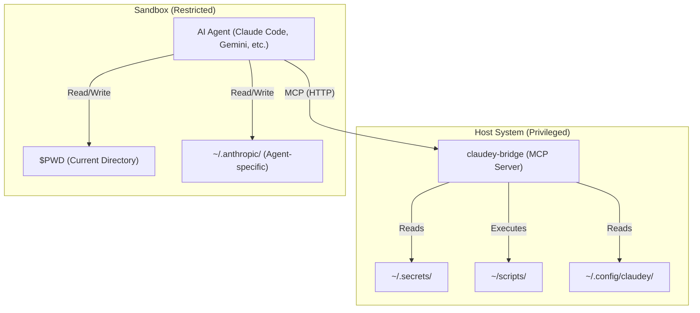

# Claudey Bridge: Secure Agent Isolation

**Status:** Design Phase  
**Goal:** Run AI coding agents in a sandbox with controlled access to privileged operations

---

## The Problem

You want to give autonomous AI agents (Claude Code, Gemini CLI) the ability to perform useful tasks (deploying code, restarting services, managing infrastructure) **without** giving them unrestricted access to your system's credentials.

### The Risks

1. **Prompt Injection:** Malicious input could trick the agent into reading `~/.aws/credentials` or `~/.ssh/id_rsa`
2. **Accidental Damage:** Agent might hallucinate destructive commands like `rm -rf /`
3. **Credential Exfiltration:** If the agent runs in your normal shell, it can read any file you can read

### The Goal

Create a "split-brain" architecture:
- **Agent** runs in a sandbox with **NO** access to secrets
- **Agent** can only execute specific, whitelisted operations
- **Operations** run on the host with full privileges via a secure bridge

---

## The Solution

Two components working together:

### 1. **`cs`** - Sandbox Launcher
Launches AI agents in an isolated environment with controlled filesystem access

### 2. **`claudey-bridge`** - MCP Server
Exposes privileged operations as MCP tools with strict input validation



---

## User Experience

### Installation

```bash
# macOS
brew install claudey-bridge

# Linux (Debian/Ubuntu)
sudo dpkg -i claudey-bridge_0.1.0_amd64.deb

# Linux (RHEL/Fedora)
sudo rpm -i claudey-bridge-0.1.0-1.x86_64.rpm
```

### First-Time Setup

```bash
$ cs
Claudey Bridge: First-time setup

Which coding agent do you use most?
  1) Claude Code
  2) Gemini CLI
  3) Cursor
  4) Aider
  5) Other

Choice: 1

✓ Set default agent to: claude-code
✓ Starting Claudey Bridge...
✓ Launching Claude Code in /Users/you/myproject
```

### Daily Usage

```bash
# Launch your default agent in current directory
cd ~/myproject
cs

# Use a different agent
cs gemini

# That's it!
```

---

## Architecture Details

### Agent Profiles

Each agent needs access to specific config files. Profiles define what's allowed.

**Example: Claude Code Profile**
```yaml
# ~/.config/claudey/profiles/claude-code.yaml
name: claude-code
description: Anthropic Claude Code

mounts:
  # Agent needs its config and API keys
  - source: ~/.anthropic
    target: ~/.anthropic
    readonly: false
  
  - source: ~/.config/claude
    target: ~/.config/claude
    readonly: false
  
  # Read-only access to git config
  - source: ~/.gitconfig
    target: ~/.gitconfig
    readonly: true
  
  # Package manager configs
  - source: ~/.npmrc
    target: ~/.npmrc
    readonly: true
    optional: true

# Explicitly blocked (even if parent dir is mounted)
blocked:
  - ~/.ssh/id_*
  - ~/.ssh/*.pem
  - ~/.aws/credentials

env:
  - ANTHROPIC_API_KEY
  - TERM
  - LANG

bridge:
  url: http://localhost:3000
```

**Built-in Profiles:**
- `claude-code` - Anthropic Claude Code
- `gemini-cli` - Google Gemini CLI
- `cursor` - Cursor AI
- `aider` - Aider
- `minimal` - Generic fallback (workspace only)

### Sandbox Implementation

#### Linux: bubblewrap
```bash
bwrap \
  --ro-bind / / \
  --dev-bind /dev /dev \
  --proc /proc \
  --tmpfs "$HOME" \
  --bind "$PWD" "$PWD" \
  --bind "$HOME/.anthropic" "$HOME/.anthropic" \
  --ro-bind "$HOME/.gitconfig" "$HOME/.gitconfig" \
  --share-net \
  --die-with-parent \
  claude-code
```

#### macOS: sandbox-exec (Seatbelt)
```scheme
(version 1)
(allow default)  ; System libs

; BLOCK home directory
(deny file-read* file-write* (subpath (param "HOME")))

; ALLOW workspace
(allow file-read* file-write* (subpath (param "WORKSPACE")))

; ALLOW agent config
(allow file-read* file-write* (subpath (string-append (param "HOME") "/.anthropic")))

; ALLOW localhost network
(allow network-outbound (remote ip "localhost:*"))
```

### Bridge Server

**MCP Server exposing three tools:**

#### 1. `list_programs()`
Returns available privileged operations
```json
[
  {"name": "deploy_prod", "description": "Deploy to production/staging"},
  {"name": "restart_db", "description": "Restart PostgreSQL"}
]
```

#### 2. `help(program: str)`
Returns full documentation for a tool
```markdown
# Deploy to Production

Use this tool to deploy the application.

## Examples
- `execute("deploy_prod", ["staging", "feature-branch"])`
- `execute("deploy_prod", ["prod", "main"])`
```

#### 3. `execute(program: str, args: List[str])`
Executes a whitelisted operation with validated arguments

### Tool Definitions

Each privileged operation is defined in a Markdown file with YAML frontmatter:

**`~/.config/claudey/tools/deploy_prod.md`**
```markdown
---
name: deploy_prod
description: Deploys the application to production or staging
command: ~/scripts/deploy.sh
args:
  - name: environment
    type: enum
    allowed: ["staging", "prod"]
  - name: branch
    type: string
    pattern: "^[a-z0-9-]+$"
    default: "main"
---

# Deploy to Production

Use this tool to deploy the application.

## Examples

**Deploy to Staging:**
`execute("deploy_prod", ["staging", "feature-branch"])`

**Deploy to Prod:**
`execute("deploy_prod", ["prod", "main"])`
```

**Automatic Validation:**
- `environment="dev"` → **Rejected** (not in enum)
- `branch="; rm -rf /"` → **Rejected** (regex mismatch)
- `environment="prod", branch="main"` → **Allowed**

---

## Security Model

### What's Protected

**Blocked by default:**
- SSH keys (`~/.ssh/id_*`)
- Cloud credentials (`~/.aws/`, `~/.config/gcloud/`)
- API tokens (unless explicitly mounted)
- Entire home directory (except workspace and agent config)

**Allowed:**
- Current workspace (`$PWD`) - read/write
- Agent-specific config (per profile) - read/write
- Git config - read-only
- Package manager configs - read-only
- Localhost network (to reach bridge)

### Input Validation

All bridge tool arguments validated using JSON Schema:
- **Type checking** (string, integer, boolean, enum)
- **Regex patterns** (prevent injection)
- **Enum constraints** (whitelist values)
- **Required vs optional** parameters

### Escape Prevention

**Linux (bubblewrap):**
- Unprivileged user namespaces
- Read-only root filesystem
- Temporary home directory
- Selective bind mounts
- No setuid/setgid

**macOS (Seatbelt):**
- Mandatory Access Control (MAC)
- Path-based restrictions
- Network restrictions
- Process isolation

---

## Configuration

### User Config Directory
```
~/.config/claudey/
├── config.yaml           # Main configuration
├── profiles/             # Agent profiles
│   ├── claude-code.yaml
│   ├── gemini-cli.yaml
│   └── minimal.yaml
└── tools/                # Privileged operations
    ├── deploy_prod.md
    ├── restart_db.md
    └── backup.md
```

### Main Configuration
```yaml
# ~/.config/claudey/config.yaml
default_agent: claude-code

bridge:
  port: 3000
  auto_start: true
  
agents:
  code:
    command: claude-code
    profile: claude-code
  
  gemini:
    command: gemini
    profile: gemini-cli
```

---

## Comparison with Alternatives

### vs. Running Agent Directly
| Aspect | Direct | Claudey Bridge |
|--------|--------|----------------|
| **Security** | Agent has full access | Agent sandboxed |
| **Secrets** | Can read SSH keys, tokens | Blocked |
| **Operations** | Unrestricted | Whitelisted only |
| **UX** | Simple | Simple (`cs`) |

### vs. SSH Bridge
| Feature | SSH Bridge | Claudey Bridge |
|---------|-----------|----------------|
| **Interface** | Raw shell commands | Structured MCP tools |
| **Validation** | Bash parsing (fragile) | JSON Schema (robust) |
| **Setup** | SSH keys, sshd config | Zero-code YAML |
| **Platform** | Linux-first | Linux + macOS |

### vs. Docker/Containers
| Aspect | Docker | Claudey Bridge |
|--------|--------|----------------|
| **Overhead** | Heavy (full container) | Light (namespace only) |
| **Startup** | Slow (~seconds) | Fast (~instant) |
| **Filesystem** | Isolated volumes | Selective mounting |
| **Complexity** | Dockerfile, images | Simple config |

---

## Platform Support

**Supported:**
- macOS (Apple Silicon + Intel)
- Linux (Debian, Ubuntu, RHEL, Fedora)

**Not Supported:**
- Windows (no equivalent sandboxing mechanism)

---

## Project Status

**Current Phase:** Design & Planning

**Next Steps:**
1. Phase 0: Proof of Concept (validate risky assumptions)
2. Phase 1: Core Implementation
3. Phase 2: Distribution & Packaging

See [IMPLEMENTATION.md](./IMPLEMENTATION.md) for detailed execution plan.

---

## Related Projects

- [MCP Specification](https://spec.modelcontextprotocol.io/)
- [Bubblewrap](https://github.com/containers/bubblewrap) - Linux sandboxing
- [Claude Code](https://docs.anthropic.com/en/docs/claude-code) - Anthropic's coding agent
- [Gemini CLI](https://ai.google.dev/) - Google's AI CLI

---

## License

Apache 2.0
